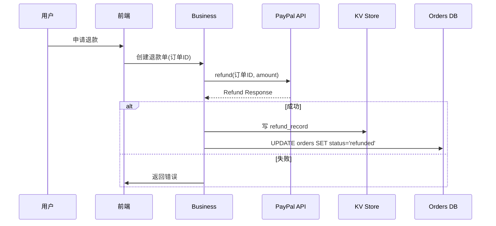

# 退款 SOP（TempoSoul）

> ⚠️ **实现状态挂账（WIP，本 SOP 暂不可上机执行）**
> - **已完成**：`orders` 表已建（T04）。
> - **尚未实现**：`refunds` 表迁移、`POST /api/v1/refunds` 退款端点、前端退款入口均**未落地**；PayPal Live key 亦未到位。
> - **结论**：本文档为「流程先行」说明，待后续补卡实现 `refunds` 表与退款 API 后方可作为真实操作依据上机执行。

## 1. 触发条件
| 触发机制 | 说明 |
|---|---|
|**退款请求** | 用户在前端点击“退款”或系统检测到 Chargeback / Dispute。
|**系统自动** | 对单笔已完成订单（`status=completed`）的 7 天内退款要求。
|**GDPR 删除** | 用户提交一次性删除请求时，系统提供退款/归档路径。 | 

## 2. 审批流程
1. **前端弹窗**：提示“确认退款，退款金额为 ¥XX”，用户确认后后台创建 *退款单*。
2. **审批人**：业务经理（或自动化流程）在后台审核邮件列表。若退款金额>¥1000 需二级复核。
3. **系统校验**：
   * 检查订单是否已被其它资产占用（以 `paypal_transaction_id` 核验对应 Capture 是否已被退款/撤销，防止重复占用）
   * 与 PayPal Sandbox / Live 检测是否支持退款请求
   * 对 7 天退款窗口外拒绝处理
4. **执行**：
   * 对 PayPal Sandbox：使用 `payment.refund` API；
   * 对 PayPal Live：先在 PayPal 控制台核验退款凭证（确认对应 Capture 处于可退款状态）后，再调用 `payment.refund` API 发起退款。
5. **记录留存**：
   * 在 `refunds` 表记录退款日志（退款单 ID、订单 ID、金额、状态、提交时间、审核人）。
   * 将退款详情写入 *单一事实源*（GQL / KV）

## 3. 对照 GDPR
| GDPR 要求 | 退款实现 |
|---|---|
|**数据主体的删除权** | 
  * 退款后，退回金额后在数据库中标记 `deleted=true`。系统不再查询此订单；
  * 并在 KV 记录中写 `action=delete` 与 `timestamp` 供审计。 |
|**保持交易记录** | 退款生成后，旧订单状态更改为 `refunded`，并将旧记录复制到 _history_ 表，保持可追溯。 |
|**不可恢复** | 删除操作后，所有支付凭据仅保留 90 天，以满足合规；之后自动清理。 |

## 4. 交互流程示例

## 5. 审计记录示例
| 事件 | 角色 | 时间 | 备注 |
|------|------|------|------|
|退款单已创建|业务员|2026‑09‑30T12:02:31Z|未提交| 
|退款已发起|PayPal|2026‑09‑30T12:12:00Z|已成功退款| 
|用户请求删除|用户|2026‑09‑30T13:04:00Z|已满足 GDPR| 

## 6. 候选履行清单（Check‑list）
- [ ] 退款单创建
- [ ] 再确认金额
- [ ] 二级复核（>¥1000）
- [ ] 调用 PayPal API
- [ ] 写 KV & Orders 记录
- [ ] 通知用户
- [ ] GDPR 删除标记
- [ ] 加入监控告警（退款失败）

## 7. 关键链接
- **退款 API**：`POST /api/v1/refunds`
- **PayPal Sandbox**：`https://api-m.sandbox.paypal.com/v2/payments/captures/{capture_id}/refund`
- **PayPal Live**：`https://api.paypal.com/v2/payments/captures/{capture_id}/refund`

> 以上文档提供面向前端业务及后台审核的完整 flow，兼顾 GDPR 的合规性。